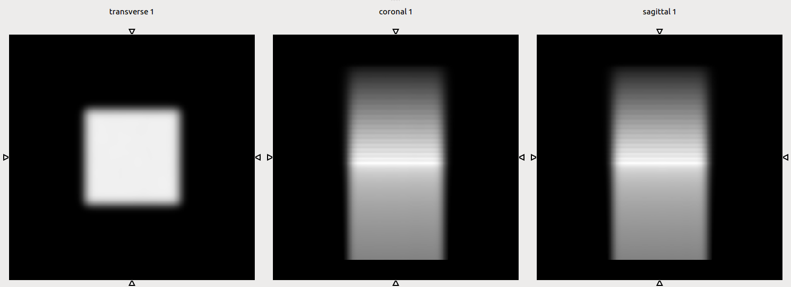

# RayTraceDicom
Sub-second pencil beam dose calculation on GPU for adaptive proton therapy

LEGAL NOTICE
------------
The core of the code within this repository is based on the PhD project of Joakim da Silva, developed within the ENTERVISION Marie Curie Initial Training Network.
The core was later refactored and documented by Fernando Hueso-González.

The code is licensed under GPLv3. When (re)using this code, attribution to Joakim da Silva must be granted and relevant papers must be cited:
- https://doi.org/10.1088/0031-9155/60/12/4777
- https://doi.org/10.1016/j.jpdc.2015.07.003

REQUIREMENTS
------------
- CUDA, CUDA-TOOLKIT, CUDA-SAMPLES
- GDCM
- ITK (if custom build, then with `-DITK_USE_SYSTEM_GDCM=ON`)

BUILDING
--------
- `mkdir build`
- `cmake <path/to/src>/RayTraceDicom`, optionally with `-DITK_DIR=/path/to/build`
- `make`

EXAMPLE FILES
-------------
To generate a dummy water phantom CT and RT plan, use:
- `python3 extern/dicom-interface/rti/test/dicom/generate_water_cube.py --outdir /tmp/watercube/`

RUNNING
-------
- `./RayTraceDicom --output_directory /tmp/watercube/ --ct_dir /tmp/watercube/ct/ --rtplan /tmp/watercube/rtplan.dcm --beams G000`
